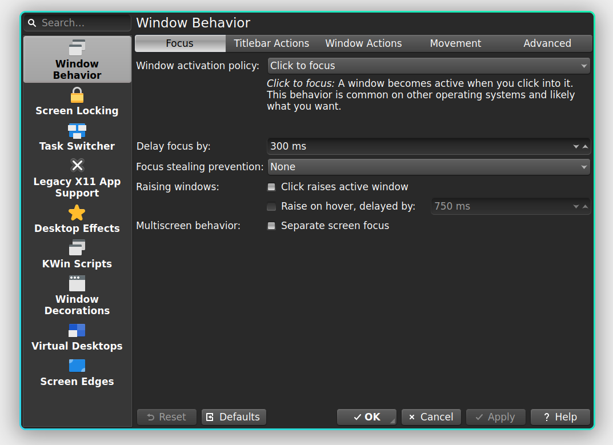
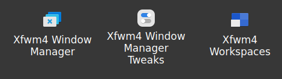

## WM Integration Files for LXQt

### kwin_wayland

Desktop files using single KConfig Modules for `kwin_wayland`, example `Kwin Wayland Settings`:



**Note**: Setting the env var `QT_QUICK_CONTROLS_STYLE=org.kde.desktop` in
"Session Settings > Advanced" is recommended. Kwin Qt5 is not supported.


 * Input Settings (Keyboard, Mouse and Touchpad)
 * Shortcuts
 * Monitor
 * KWin Wayland Settings

Package `systemsettings` from KDE Plasma is needed at least, for some modules `plasma-desktop `
may be needed. See `kcmshell6 --list` for all modules available in your installation.

#### Installation


```
git clone https://github.com/lxqt/lxqt-WM-integration-files`
cp lxqt-WM-integration-files/applications/lxqt-kcmshell6* ~/.local/share/applications/

```

### kwin_x11

One menu entry for Kwin x11 Settings.

#### Installation

```
git clone https://github.com/lxqt/lxqt-WM-integration-files`
cp lxqt-WM-integration-files/applications/lxqt-kwin_x11.desktop ~/.local/share/applications/

```

### xfwm4

By default the 3 menu entries to configure `xfwm4` are only shown in Xfce and have a generic
title. The `.desktop` files provided here will be shown like this:



#### Installation


```
git clone https://github.com/lxqt/lxqt-WM-integration-files
cp lxqt-WM-integration-files/applications/xfce*  ~/.local/share/applications/
```
